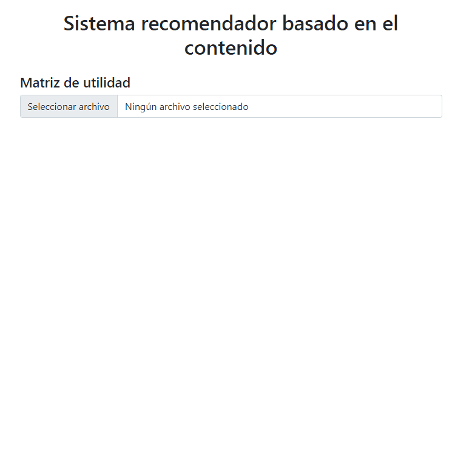

# KB-RecommenderSystem
Sistema de recomendación basado en el contenido. 


## **`Recommender`**

Clase que representa el recomendador, contiene los siguientes atributos:  

* `corpus`: Vector de elementos `CorpusDocument`
* `IDF`: Objeto que almacena los términos y el correspondiente valor de `IDF` para el mismo.
  ```JavaScript
  IDF = {
    "apple": 2.3,
    "acidity": 3.2,
    ...
  }
  ```

### **Métodos**

* **`constructor(textCorpus?: string)`**: si se proporciona un `textCorpus` se llama a `setup(textCorpus)`


* **`setup(textCorpus: string)`**: Crea los documentos a partir de `textCorpus` y calcula `IDF`.  
El formato de corpus soportado es una `string` en la que cada línea (separadas por `\n`) representa un documento diferente.

* **`loadCorpusFromText(textCorpus: string)`**: convierte `textCorpus` en un vector de `CorpusDocument` y lo guarda en el atributo `corpus`

* **`getIDF()`**: calcula el valor de *IDF* para cada uno de los términos contenidos en `corpus` y lo guarda como un objeto clave - valor (término - IDF) en el atribudo `IDF`.

* **`getTable(doc: CorpusDocument)`**: A partir de los términos contenidos en `doc` devuelve una matriz con las  columnas: Término, TF, IDF, TF-IDF.

* **`createTables()`**: devuelve un array de matrices generadas para cada documento del corpus con el método `getTable(doc: CorpusDocument)`

* **`sim(aIndex: int, bIndex: int)`**: devuelve la similitud entre los documentos con índice `aIndex` y `bIndex` dentro de `corpus`.


## **`CorpusDocument`**
Clase que representa un documento. Sus atributos son:

* `TF`: objeto clave-valor (término - TF) para todos los términos que aparencen en el documento.
* `normalizedTF`: objeto clave-valor (término - normalizedTF) para todos los términos que aparecen en el documento. 
  
Para calcular el valor normalizado primero se calcula la *longitud del vector*, esto es, la raíz cuadrada de la suma de los cuadrados de los valores de `TF` y posteriormente se divide cada valor de `TF` entre dicha longitud:

```JavaScript
  loadNormalizedTF() {
    const vectorLength = Math.sqrt(Object
      .values(this.TF)
      .reduce((a, b) => a + b ** 2, 0));

    const normalizedTF = {...this.TF};
    Object
      .entries(normalizedTF)
      .forEach(([term, tf]) => normalizedTF[term] = tf / vectorLength);

    this.normalizedTF = normalizedTF;
  }
```


### **Métodos**

* **`constructor(textContent?: string)`**: si se le pasa `textContent` se llama a `setup(textContent)`


* **`setup(textContent: string)`**: se encarga de cargar los términos con sus frecuencias absolutas y con sus frecuencias normalizadas.
  
* **`loadTextContent(textContent: string)`**: a partir de `textContent` genera un objeto clave - valor (término - TF) con la frecuencia absoluta para cada término que aparece en el documento y lo almacena en `TF`.

Este método primero eliminará los siguiente signos de puntuación del documento: `!"#$%&\'()*+,-./:;<=>?@[\\]^_{|}~` y `, luego convertirá todas las palabras del documento a minúsculas, eliminará los espacios en blanco al principio y al final del documento y obtendrá los términos como aquellas palabras separadas por uno o más espacios en blanco.


* **`loadNormalizedTF()`**: a partir de `TF` calcula los valores normalizados para cada término y los almacena en `normalizedTF`.  


# **Ejemplos de uso**

* [Corpus de prueba 1](https://github.com/cexposit/ull-gco/blob/main/examples-documents/documents-01.txt)
  


* [Corpus de prueba 2](https://github.com/cexposit/ull-gco/blob/main/examples-documents/documents-02.txt)
  


